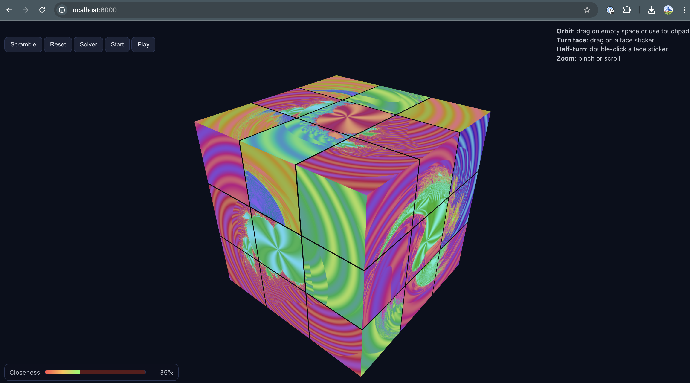

## 3×3 Rubik's Cube Web Game

A touchpad-friendly 3D Rubik's cube built with Three.js. Faces can use sliced images or procedural fractal art. Includes Setup and Play modes, scramble/reset, and an animated Assemble (solve) feature.



### Quick start

1) From the project folder run a simple server, then open Chrome:

```bash
python3 -m http.server 8000
```

Open `http://localhost:8000`.

Why a server? ES modules and textures won’t load via `file://`.

### Files

- `index.html` — import map, UI, loads the app
- `styles.css` — minimal UI styling
- `src/main.js` — Three.js scene, cube logic, gestures, modes
- `assets/` — optional images `face-U.jpg`, `face-D.jpg`, `face-L.jpg`, `face-R.jpg`, `face-F.jpg`, `face-B.jpg`

### Controls

- Orbit: drag on empty space or use the touchpad
- Turn face: drag on a face sticker
- Half-turn: double‑click a face sticker (180°)
- Zoom: pinch or scroll
- Buttons: Scramble, Reset, Assemble, Start (Setup), Play

### Modes

- Setup (Start): toggled by the Start button. While active, every turn increments and records the setup sequence. Press Start again to stop.
- Play: shows a “Closeness” bar. After each turn, the game estimates how close you are to solved (green is closer). Assemble also updates this bar during and after the animation.

### Features

- 3×3 cube made of 27 cubelets with realistic layer turns
- Image slicing: each face can be a 3×3 slice of a single image
- Procedural textures: optional fractal art per face (distinct hue per side)
- Trackpad-friendly orbit and zoom
- Scramble, Reset, and animated Assemble (replay inverse moves)

### Custom images (optional)

Place six images in `assets/` with these names:

- `face-U.jpg`, `face-D.jpg`, `face-L.jpg`, `face-R.jpg`, `face-F.jpg`, `face-B.jpg`

If any are missing, the app falls back to generated art.

### Procedural fractal faces (default)

By default, the app generates colorful fractal images for each face.

You can customize in `src/main.js`:

- `USE_FRACTAL_FACES`: set to `false` to prefer `assets/face-*.jpg`
- `FACE_HUES`: base hue per face (degrees 0–360) to keep faces distinct
- In `generateFractalFaceTexture` you can tune:
  - `maxIter` (detail), `zoom` (scale), swirl strength `a = 0.55 * r2`
  - fractal type selection: Julia, Mandelbrot, Multibrot‑3, Burning Ship

### Troubleshooting

- “Failed to resolve module specifier ‘three’”: make sure you’re running via `http://localhost:...` and the import map in `index.html` is present.
- Image 404s (`assets/face-*.jpg`): they’re optional; the app will generate placeholders/fractals.
- Nothing renders via `file://`: run a local server (see Quick start).

### Browser support

- Built and tested for Chrome (desktop). Trackpad gestures recommended on macOS.


